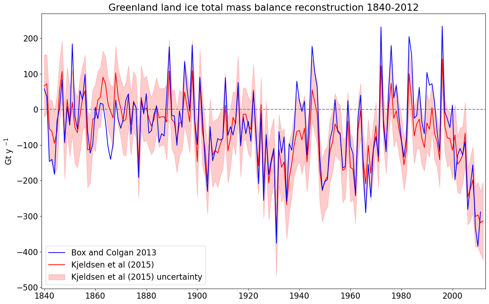

# Greenland land ice total mass balance reconstruction 1840-2012
An empirical modeling of Greenland land ice total mass balance reconstruction appears in Box and Colgan (2013) and is updated in Kjeldsen et al (2015).

- Box, J. E. and Colgan, W.: Greenland Ice Sheet Mass Balance Reconstruction. Part III: Marine Ice Loss and Total Mass Balance (1840–2010), Journal of Climate, 26(18), 6990–7002, doi:10.1175/jcli-d-12-00546.1, 2013.
- Kjeldsen, K. K., Korsgaard, N. J., Bjørk, A. A., Khan, S. A., Box, J. E., Funder, S., Larsen, N. K., Bamber, J. L., Colgan, W., van den Broeke, M., Siggaard-Andersen, M.-L., Nuth, C., Schomacker, A., Andresen, C. S., Willerslev, E. and Kjær, K. H.: Spatial and temporal distribution of mass loss from the Greenland Ice Sheet since AD 1900, Nature, 528(7582), 396–400, doi:10.1038/nature16183, 2015.

Data are organized in two .csv files:
- Greenland_mass_balance_1840-2011_Box_and_Colgan_2013.txt
- Greenland_mass_balance_totals_1840-2012_ver_20141130_with_uncert_via_Kjeldsen_et_al_2015.csv

Notes
- Units are Gt
- Solid Ice Discharge is what Box and Colgan (2013) call Marine Ice Loss. 
- TMB is total mass balance.
- uncertainties are given in the

